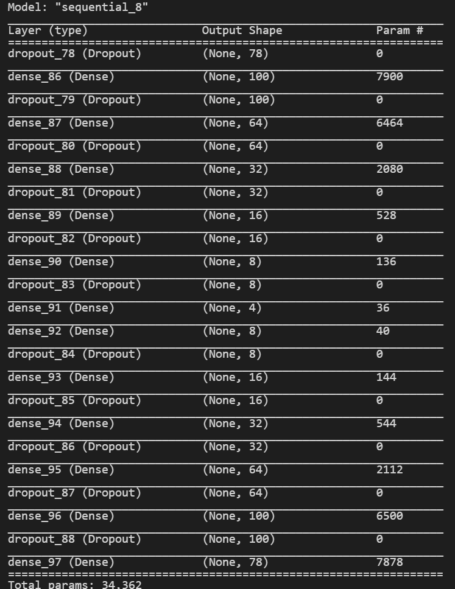
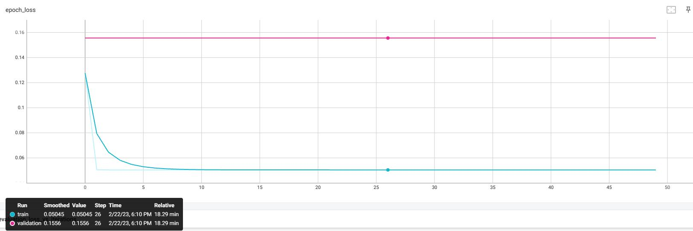
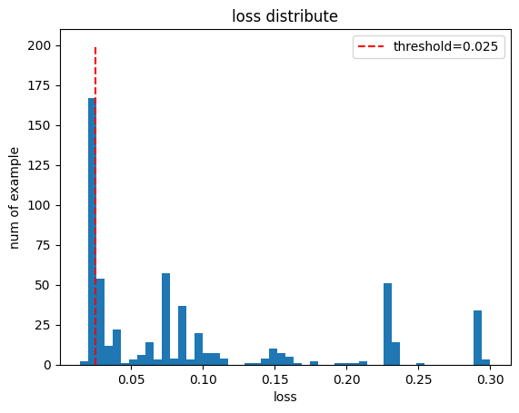
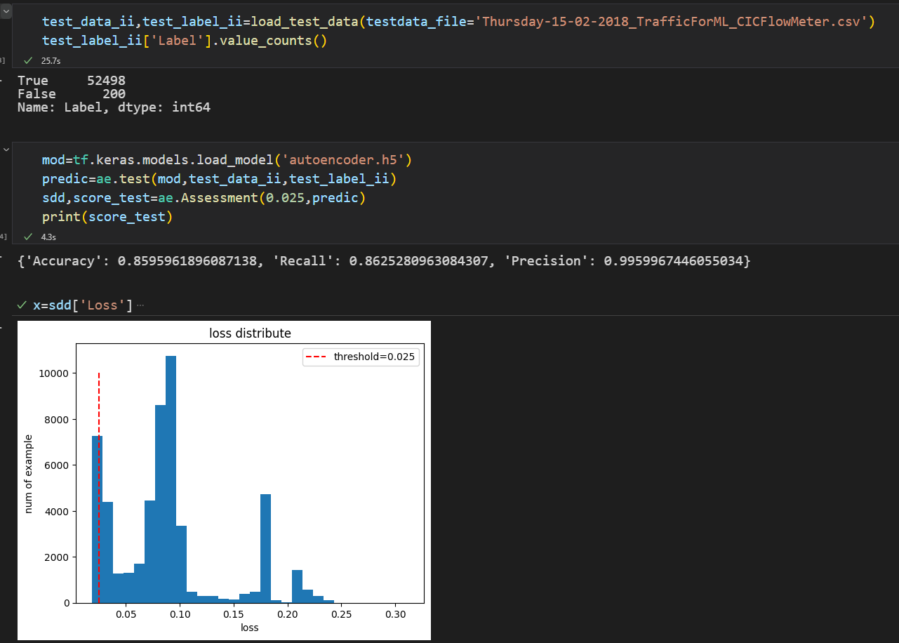
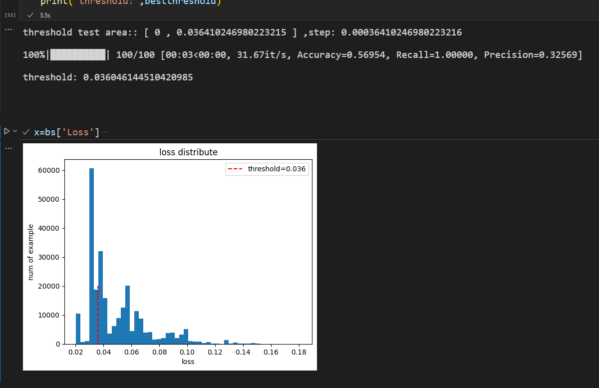

# Autoencoder
test of AE
测试自动编码器的效果，参考论文《Autoencoder-based_Intrusion_Detection_System》  
一维的AE效果还可以，基本达到了原文所述的效果  
结构如下：  
  
训练集仅由正常数据组成，验证集仅由异常数据组成，可以看到两者的重建误差之间存在明显距离：  
  
测试集由近乎1：1的正常数据和异常数据组成，其重建loss分布如下：  
  
优化得到最佳阈值：0.025，在第二个测试集上进行验证：  
  

均可以得到还不错的效果；   
   
然后尝试了使用zigzag预处理，并用全卷积搭建CAE，但是得到的效果不如人意，可能是因为在zigzag过程中数据细节被过分放大，导致模型过拟合，在训练阶段正常数据与异常数据仍然存在较大的重建误差差距，但是应用到测试集的时候，这种差距并不明显，准确率下降到只有58%左右，zigzag可能并不适合无监督学习（争议  

